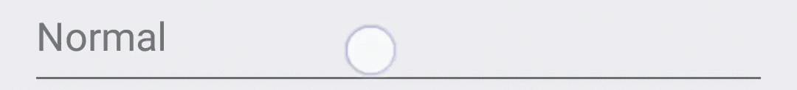
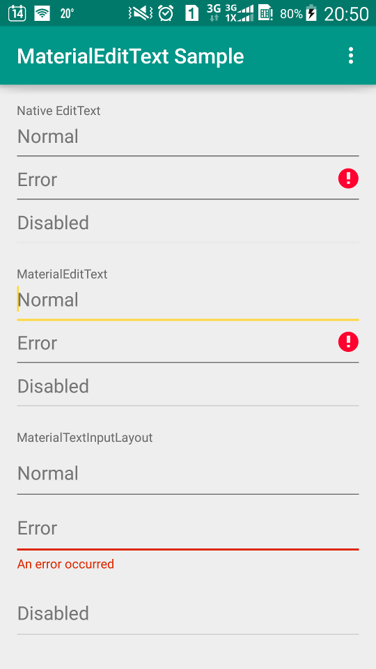

# MaterialProgressBar

Material Design `EditText` with a delightful linear ripple in background.

## Preview

Native `EditText` (on Samsung S4 with Android 5.0.1):



`MaterialEditText`:




[Sample APK](//github.com/DreaminginCodeZH/MaterialEditText/releases/download/v1.0.0/sample-release.apk)

## Design

This library took the framework implementation of `RippleDrawable` as reference to implement an `EditText` background with a ripple on the line. The `MaterialEditTextBackgroundDrawable` is made to behave just the same as the framework XML implementation of `EditText` background, so that a drop-in replacement should not affect your layout and alignment.

For simplicity of usage, a `MaterialEditText` is created to set the background automatically, and set the hotspot of ripple on platforms prior to Lollipop.

The `InputTextLayout` from Design Support Library can automatically set the red tint on background when an error is set. An `MaterialInputTextLayout` is introduced to make the background drawable show a bold red line consistent with Material Design Guideline when an error is set.

## Integration

Gradle:

```gradle
compile 'me.zhanghai.android.materialedittext:library:1.0.0'
```

## Usage

Simply replace your `EditText` with `MaterialEditText` and `TextInputLayout` with `MaterialTextInputLayout`, then you can enjoy the delightful detail now.

For example:

```xml
<me.zhanghai.android.materialedittext.MaterialTextInputLayout
    android:layout_width="match_parent"
    android:layout_height="wrap_content">

   <me.zhanghai.android.materialedittext.MaterialEditText
        android:layout_width="match_parent"
        android:layout_height="wrap_content" />
</me.zhanghai.android.materialedittext.MaterialTextInputLayout>
```

## ProGuard

The AAR of this library has already included a Proguard configuration file to make `ObjectAnimator` work properly.

## Older versions

Neither Support v4 nor AppCompat v7 backported animation API to versions prior to ICS, and the [NineOldAndroids](https://github.com/JakeWharton/NineOldAndroids/) library has already been deprecated since people should all be using `minSdkVersion="14"` now, so versions older than ICS are not supported.

## License

    Copyright 2015 Zhang Hai

    Licensed under the Apache License, Version 2.0 (the "License");
    you may not use this file except in compliance with the License.
    You may obtain a copy of the License at

       http://www.apache.org/licenses/LICENSE-2.0

    Unless required by applicable law or agreed to in writing, software
    distributed under the License is distributed on an "AS IS" BASIS,
    WITHOUT WARRANTIES OR CONDITIONS OF ANY KIND, either express or implied.
    See the License for the specific language governing permissions and
    limitations under the License.
